# Interface Overview

The application consists of two panels, a settings panel on the left (1) and the interactive graph panel on the right (2):

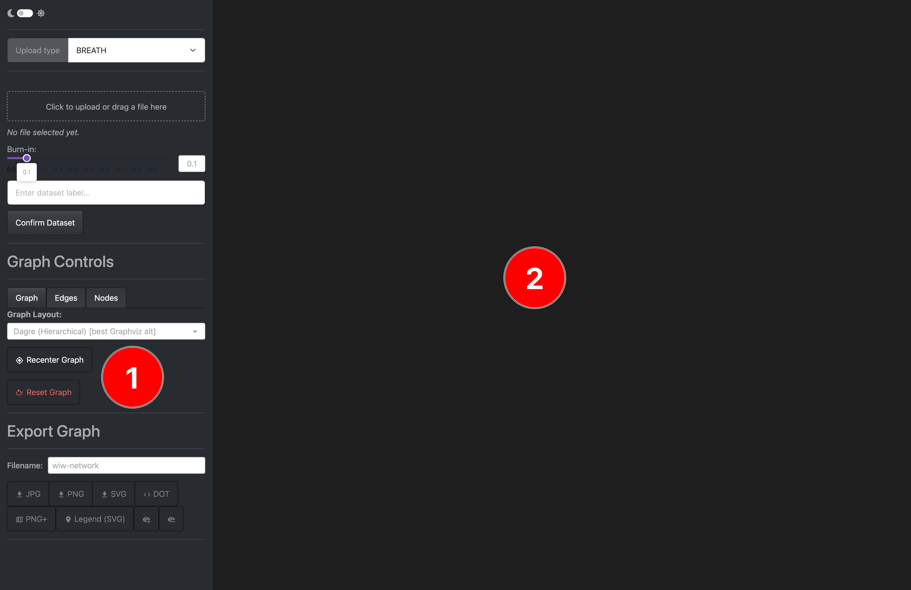

Starting the app will also open a terminal, note that the app is running only with this open.
The terminal will also contain log information messages.

## Main Options

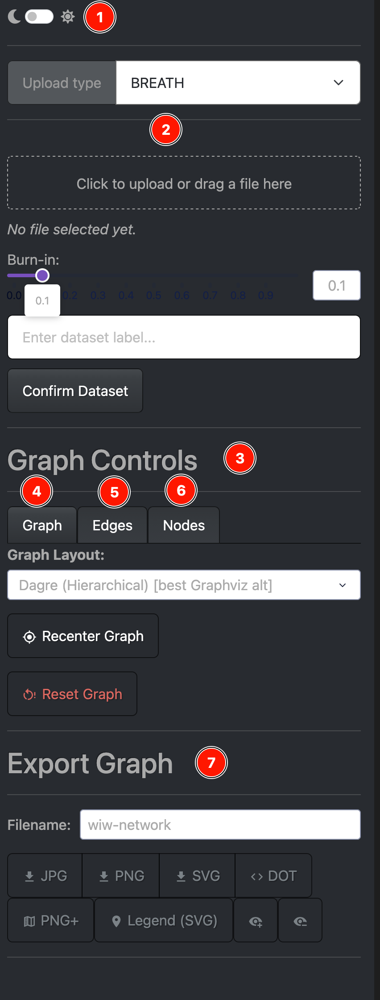{: style="width:300px;"}

### Controls explained

1. **Theme toggle**
   Switch between dark and light mode.

2. **Upload panel**
   Load WIW datasets. See upload documentation for details.

3. **Graph control panel**
   Choose Tab for specific settings.

4. **Graph options**
   Global visualization settings.

5. **Edge settings**
   Control edge colors, filtering, and visibility.

6. **Node settings**
   Adjust node appearance and labels.

7. **Export**
   Save the current graph view or data.

## Upload Panels

This app supports several input formats described below.

Invalid or unexpected files are not strictly validated. Uploading unsupported formats may result in errors or unexpected behaviour.

---

### BREATH trees

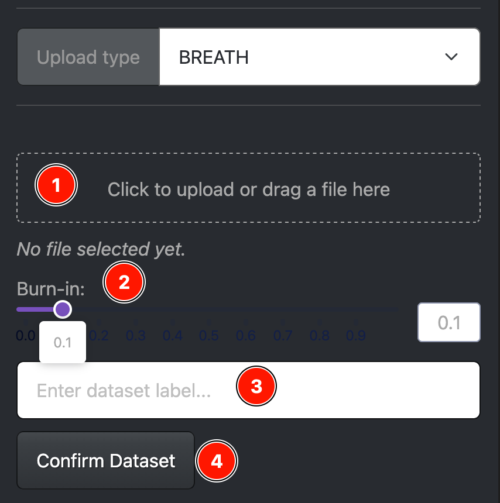{: style="width:300px;"}

1. **File Upload Panel** Click to select a file or drag and drop a file into the upload area.
2. **Burn-in selection** Select the burn-in value used for processing the tree data.
3. **Dataset Label** Assigned Label for the resulting network edges. *Note: duplicate labels are not currently prevented and will result in multiple edges*
4. **Confirm Upload** Load the file and constructs the network. Processing time depends on the number of input transmission trees.

---
### Transphylo

For transphylo the app supports two types of `rds` data upload.
The whole MCMC output or a precomputed WIW matrix. 

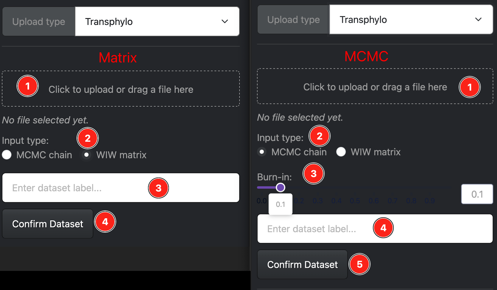{: style="width:600px;"}

1. **File Upload Panel** Click to select a file or drag and drop a file into the upload area.
2. **Input type Selection** Select between MCMC or Matrix Upload.
3. **Burn-in selection** Select the burn-in value used for processing the tree data.
4. **Dataset Label** Assigned Label for the resulting network edges. *Note: duplicate labels are not currently prevented and will result in multiple edges*
5. **Confirm Upload** Load the file and constructs the network. Processing time depends on the number of input transmission trees.

---
### Outbreaker2

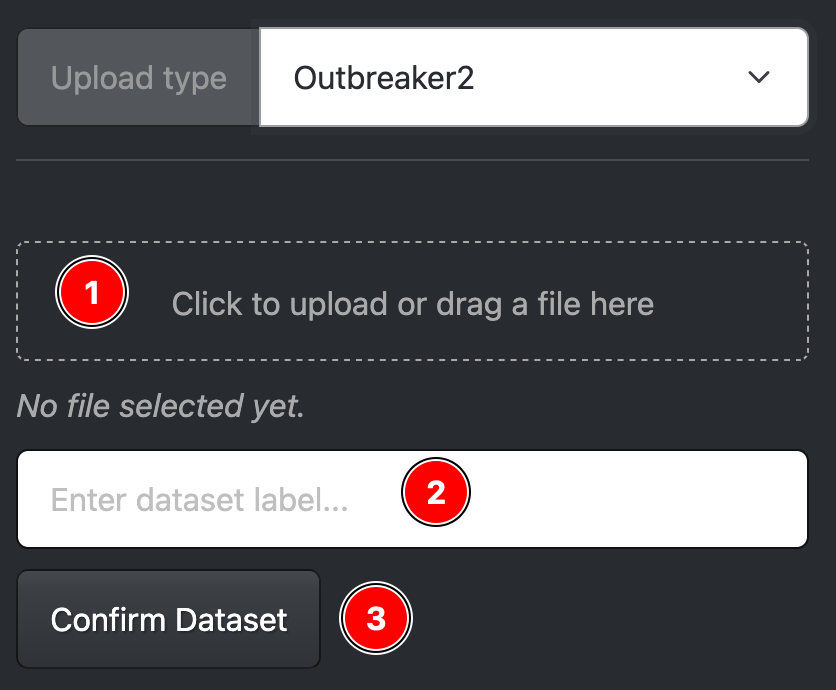{: style="width:300px;"}

1. **File Upload Panel** Click to select a file or drag and drop a file into the upload area.
2. **Dataset Label** Assigned Label for the resulting network edges. *Note: duplicate labels are not currently prevented and will result in multiple edges*
3. **Confirm Upload** Load the file and constructs the network.

---
### Custom CSV file

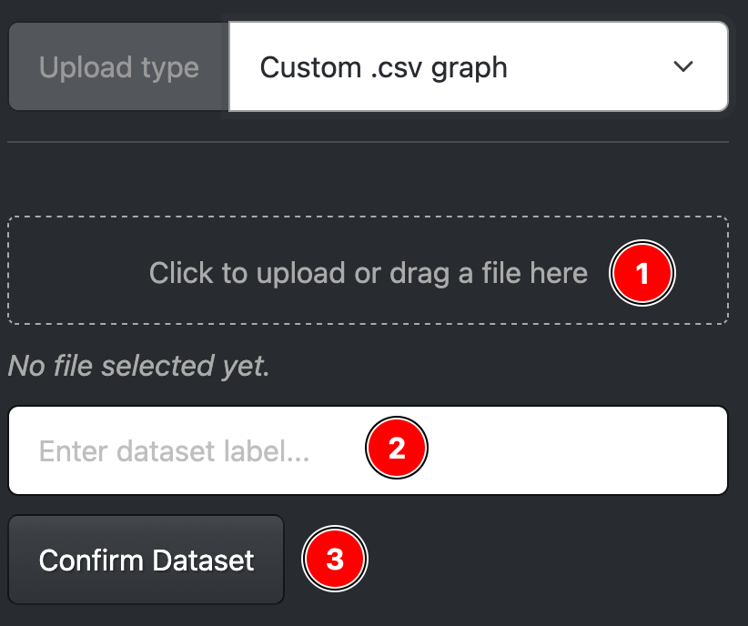{: style="width:300px;"}

1. **File Upload Panel** Click to select a file or drag and drop a file into the upload area.
2. **Dataset Label** Assigned Label for the resulting network edges. *Note: duplicate labels are not currently prevented and will result in multiple edges*
3. **Confirm Upload** Load the file and constructs the network.

---
### Metadata Annotation

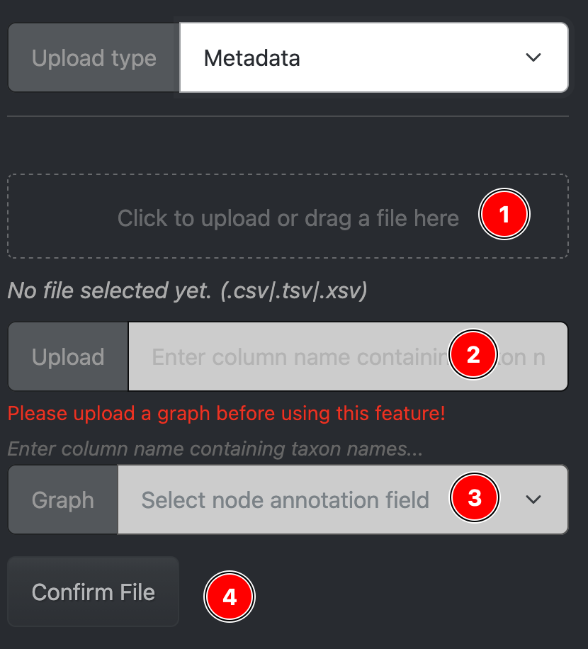{: style="width: 300px; height: auto;"}

This panel is used to map metadata from an uploaded file onto existing graph nodes.

1. **File upload panel**  
   Select a file or drag and drop it into the upload area.

2. **CSV column selector**  
   Select the column name from the uploaded CSV file that contains the metadata values.

3. **Node attribute selector**  
   Select the existing node attribute that the uploaded column should be mapped to.

4. **Confirm metadata mapping**  
   Applies the mapping between the selected CSV column and node attribute, updating the graph accordingly.

> How this works:
> Each row in the uploaded CSV is matched to a node in the graph given the column selected in (2).
> The value of that column is used to update the corresponding node attributes with the other columns in the CSV.

---
## Network Options

The following controls dynamically update the displayed network.

---

### Graph Settings

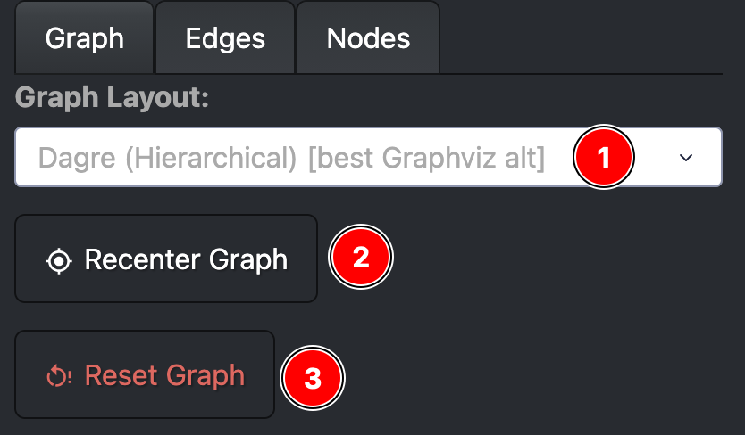{: style="width: 300px; height: auto;"}

1. **Graph layout**  
   Select the layout algorithm used to position nodes in the network.

2. **Recenter view**  
   Re-centers the graph in the viewport after zooming or panning.

3. **Reset graph**  
   Clears the current graph view (nodes and edges).  
   *Note: Some metadata annotations may persist. To fully reset, restart the application.*

---

### Edge Settings

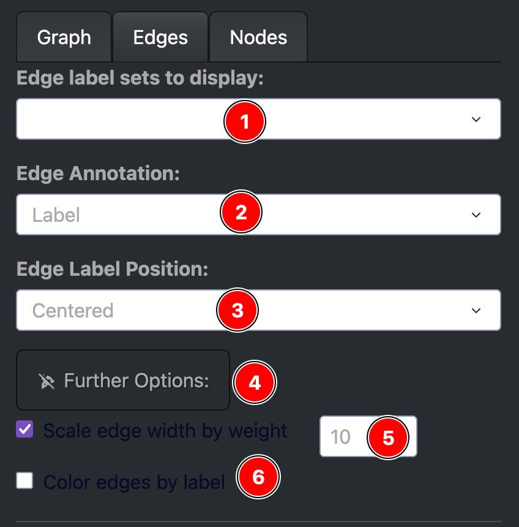{: style="width: 300px; height: auto;"}

1. **Displayed edge labels**  
   Select which edge labels are visible in the graph.

2. **Edge annotation attribute**  
   Choose which edge attribute is used for labeling.

3. **Label position**  
   Controls where edge labels are rendered along the edge.

4. **Advanced options**  
   Expand additional edge configuration settings.

5. **Edge width scaling**  
   Scales edge width based on edge weight and a user-defined scaling factor.

6. **Edge coloring by label**  
   Colors edges according to their assigned label.

---

#### Advanced Edge Options

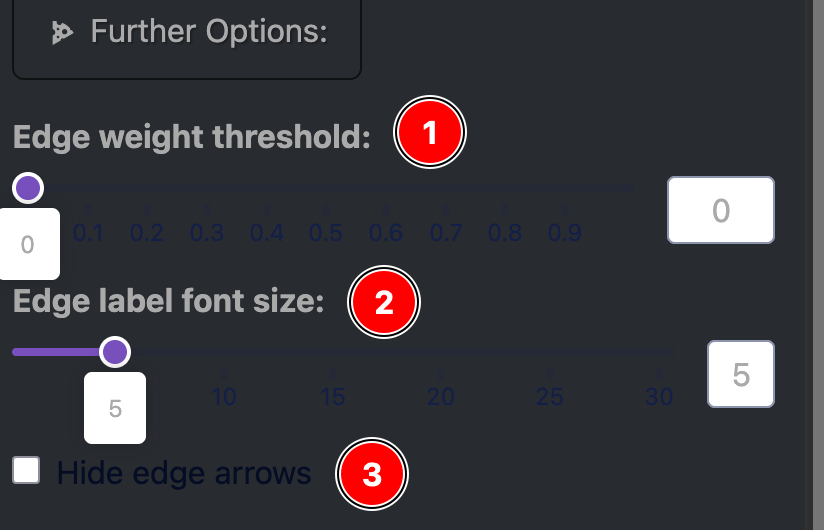{: style="width: 300px; height: auto;"}

1. **Edge threshold**  
   Filters edges by weight; only edges above the threshold are displayed.

2. **Edge label font size**  
   Adjusts the font size of edge labels.

3. **Toggle edge arrows**  
   Shows or hides directional arrows on edges.

---

### Node Settings

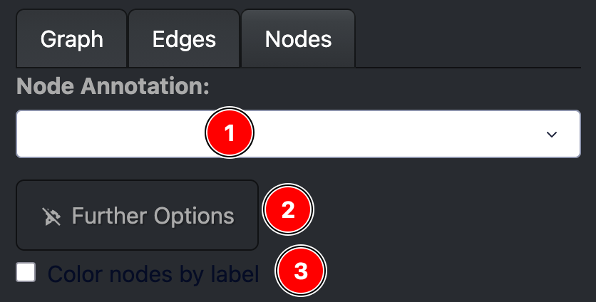{: style="width: 300px; height: auto;"}

1. **Node annotation attribute**  
   Select which node attribute is displayed as the node label.  
   *Note: This can be updated via uploaded metadata.*

2. **Advanced options**  
   Expand additional node configuration settings.

3. **Color nodes by label**  
   Enables coloring nodes based on a selected attribute (independent of the displayed label).

---

#### Advanced Node Options

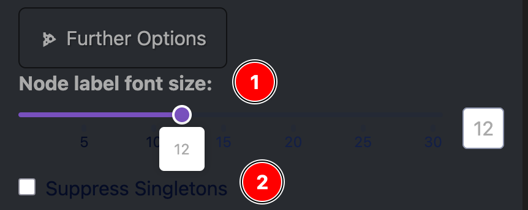{: style="width: 300px; height: auto;"}

1. **Node label font size**  
   Controls the font size of node labels.

2. **Suppress singletons**  
   Hides nodes that have no connections (degree = 0).

---
## Export Graph

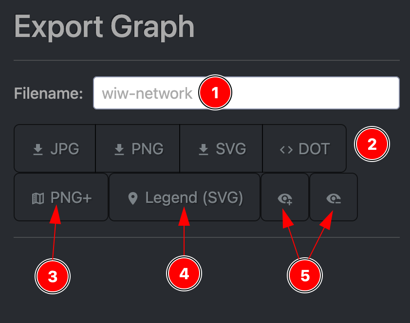{: style="width: 400px;"}

1. **Filename**  
   Specifies the filename used for exported files.

2. **Export format buttons**  
   Export the current graph in the selected format.

3. **PNG + legend**  
   Exports a PNG image of the graph with the legend embedded.

4. **Legend (SVG)**  
   Exports the legend separately as an SVG file.

5. **Legend node toggle**  
   Adds or removes the legend as a node within the graph visualization.

> **Experimental features**  
> Legend embedding in PNG exports and legend-as-node functionality are still under development.  
> The recommended export workflow is to download the SVG graph and SVG legend separately.
