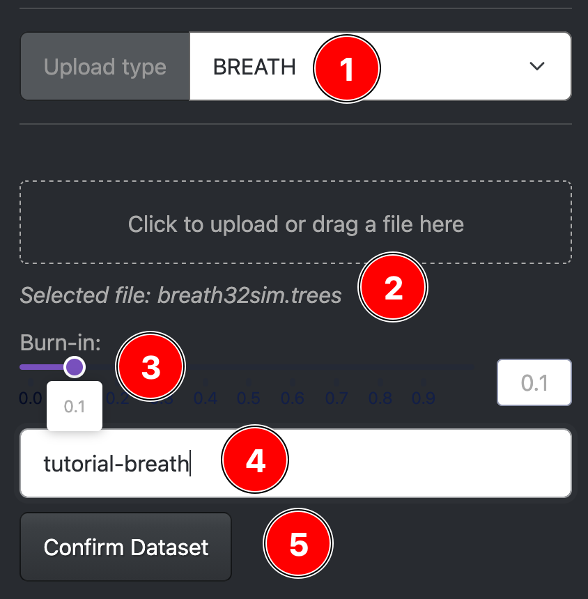
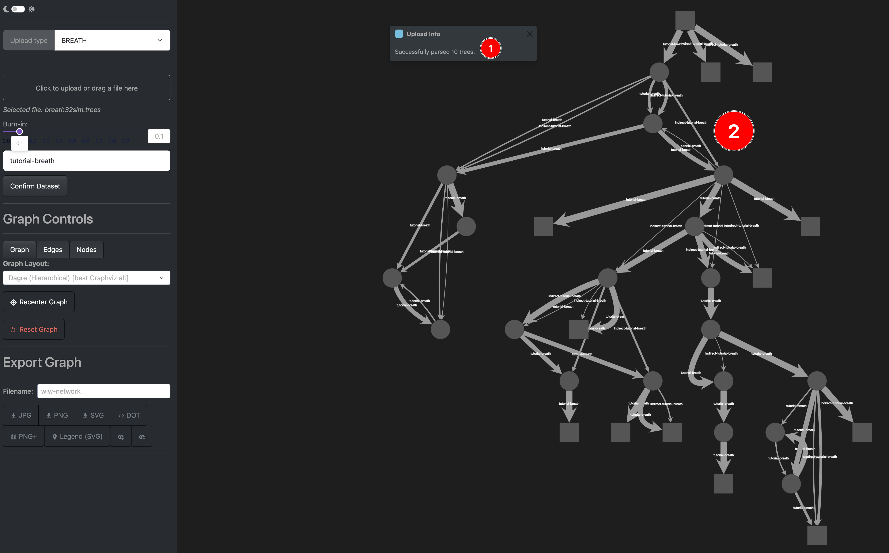
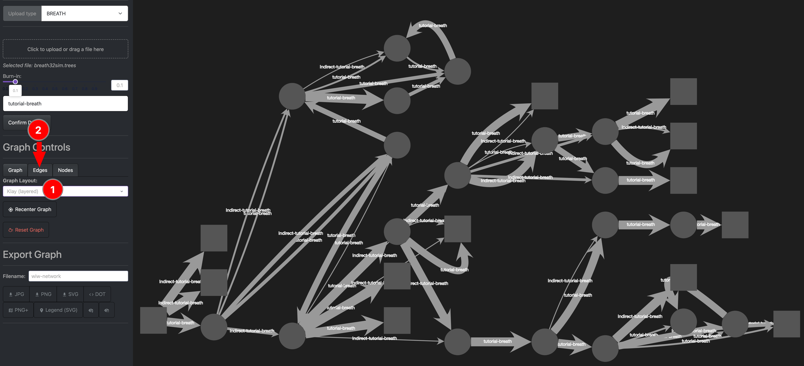
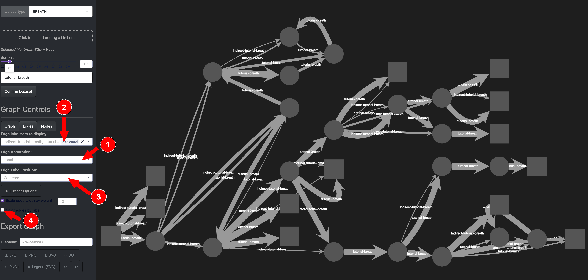
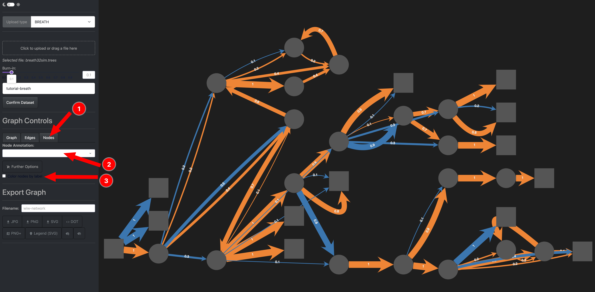
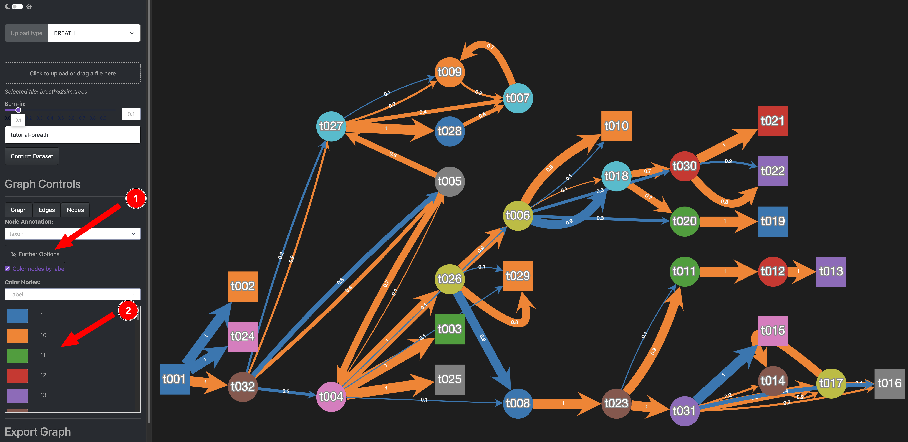
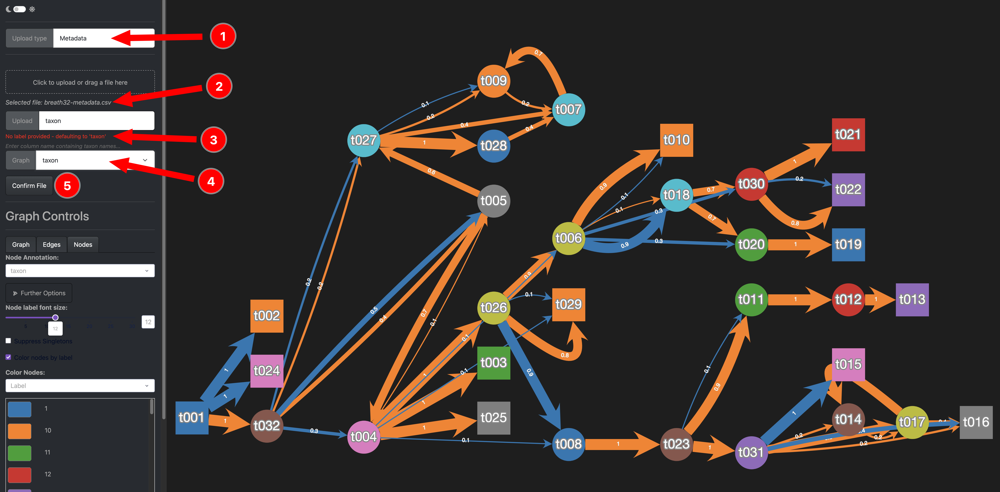
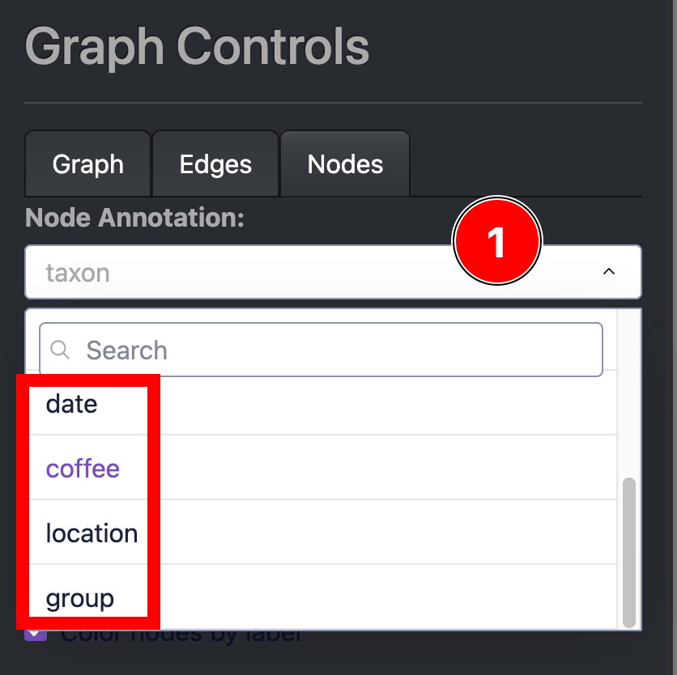
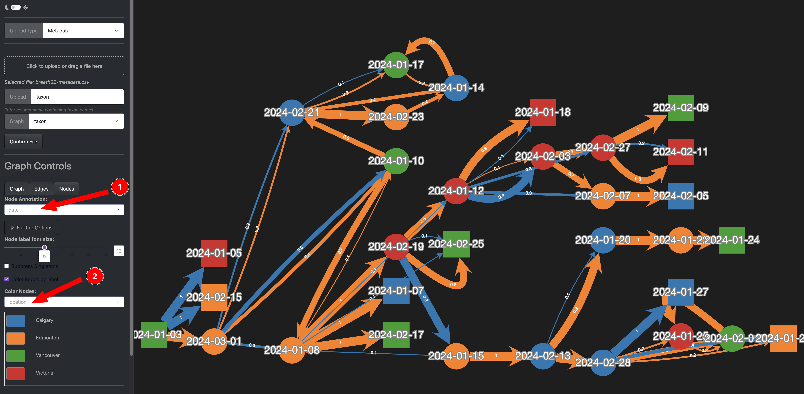
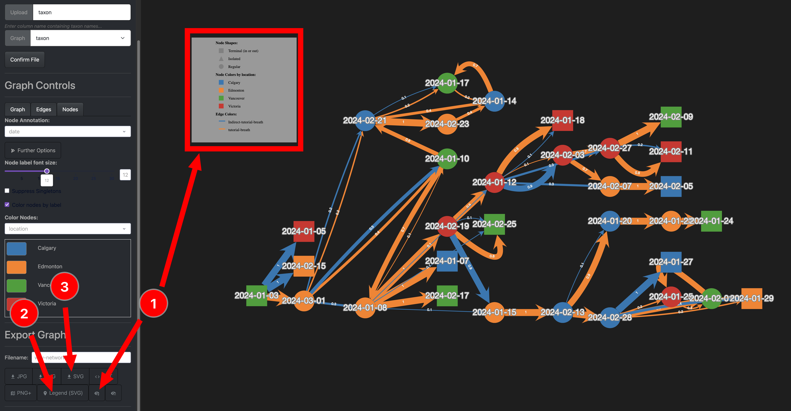

# BREATH

## Overview

Here we use the output of the **BREATH** package for BEAST2 to visualize a WIW network.

You can find the full tutorial of the package [here](https://github.com/rbouckaert/BREATH/tree/main/doc/tutorial).

---

## Input Data

The supported upload format is a `.trees` file as is produced when running the package.

These trees have to have a `blockcount` annotation on the edges.

### Download Example Data

If you want to follow along the data can be downloaded here:

- [The input trees file](../assets/tutorial-data/breath32sim.trees)
- [The additional metadata](../assets/tutorial-data/breath32-metadata.csv)

---
## Step 1: Upload a trees file

First we upload the dataset with the following steps:

{: style="width:300px;"}

1. Select BREATH as your upload mode
2. Click to select, or drag and drop the `trees` file here *A note will tell you which file you selected*
3. Choose a burn-in of 0.1 *The data has 11 trees, this will remove the first one*
4. Give your upload a custom name *We pick `tutorial-breath`*
5. Confirm and upload your dataset to the app.

{: style="width:1300px;"}

After processing the trees (*In this case its only 10 so it is quick*), you should see a popup of how many trees were loaded (1) and the initial network will be displayed (2).

---

Let us change some Graph settings next:

{: style="width:1300px;"}

1. We change the graph layout to **Klay (layered)**
    - Feel free to play around and pick a different one, for the rest of the tutorial we will be using this selection, but any other choice will work just like this.
2. For the next step we switch to the *Edges* options tab. 

---

We will now change some edge options

{: style="width:1300px;"}

1. Change the edge annotation to the *posterior* label
2. We can see that there are two sets of edges, direct and indirect transmissions
2. Change the label position to *Follow edge*
3. We toggle the color by label button to distinguish the direct and indirect transmissions

After these selections your network should look much more colorful like this:

{: style="width:1300px;"}

To further change the settings we could do the following:

1. Pick a subset of edges to display
2. Look at further options to change the edge threshold or the label font size
3. Change the Scaling Factor to increase/decrease the edge widths or make them all the same width
4. Change the color for individual labels *Simply click the color and a color picker will open*

---

Next, we want to change the node options:

{: style="width:1300px;"}

1. Select the *Node* options tab
2. Select a node annotation label, we pick *taxon* for now.
3. Toggle color by label to have colored nodes

Your network should now look like this:

{: style="width:1300px;"}

We could now:

1. Change further options for nodes like the font size of the labels
2. Pick colors for specific labels

---

## Step 2: Add metadata (optional)

To add more information to our nodes, we can upload a metadata `csv` file.

For this we will first have to go back to the upload part of the app and select the *Metadata* option.

{: style="width:1300px;"}

1. Switch to the Metadata Uplaod tab
2. Select the metadata CSV file
3. Pick the column name in the CSV file that is already a label in your nodes
4. Pick the corresponding node annotation
   - *Note that in this case taxon is flagged as default value, but our csv contains that column so it can be ignored*
5. Confirm and upload your metadata.

---

After annotation you should be able to scroll in the node annotations (1) and see new options pop up. 

{: style="width:1300px;"}

We can now utilize this extra metadata:

{: style="width:1300px;"}

1. We change the node display label to *date*
2. We change the color of the node according to the extra information *location*

---

We can now download the network as an image:

{: style="width:1300px;"}

1. You can add a legend node with the plus button *Note that this feature is in development and might have some unexpected behaviour*
2. You can also export this legend to a separate `svg` file that will be downloaded.
3. Download the currently displayed network as an `svg` file.

Other file formats are also provided, however I would recommend using `svg` because it is a vector image and has infinite resolution. 

---
