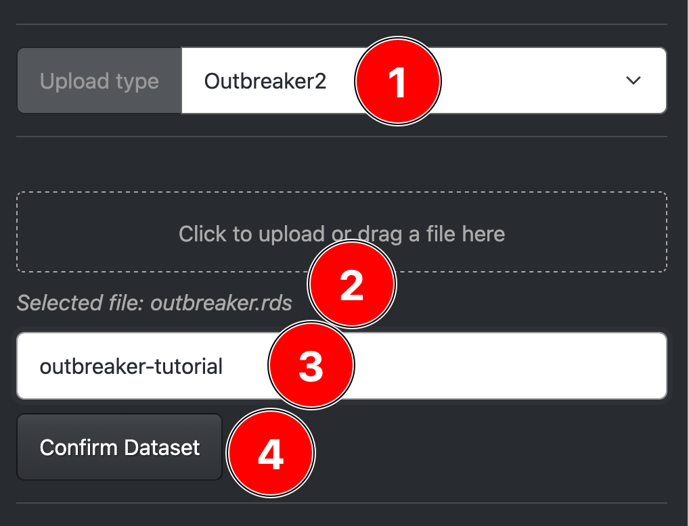
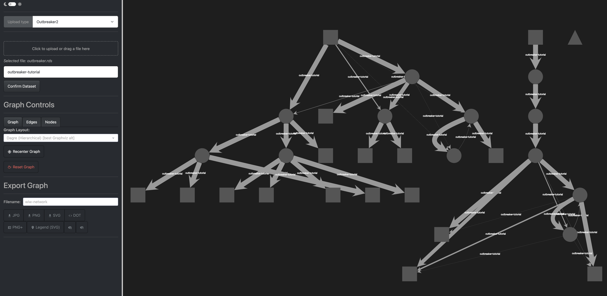
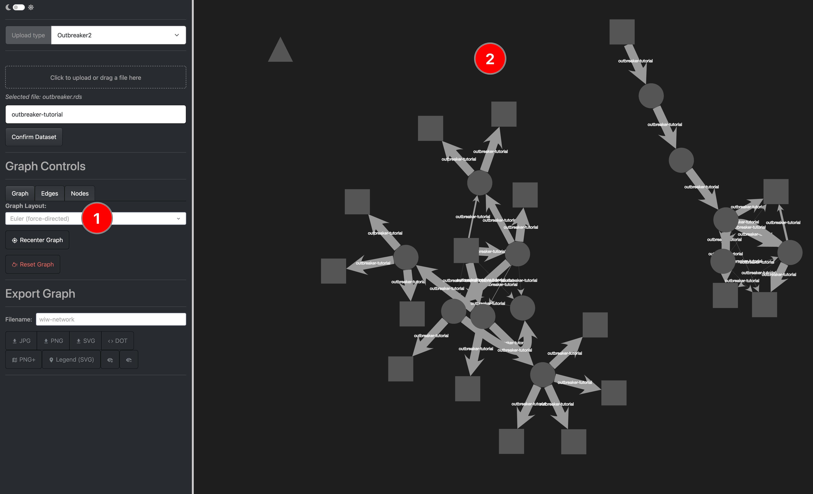
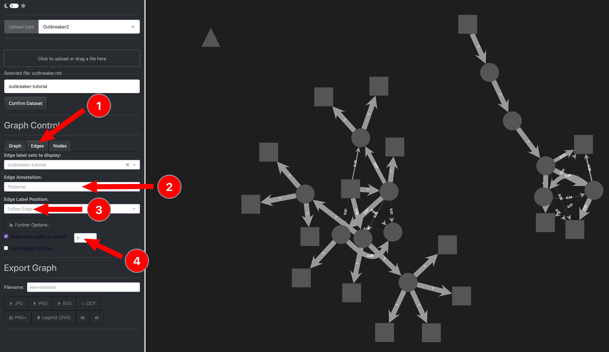
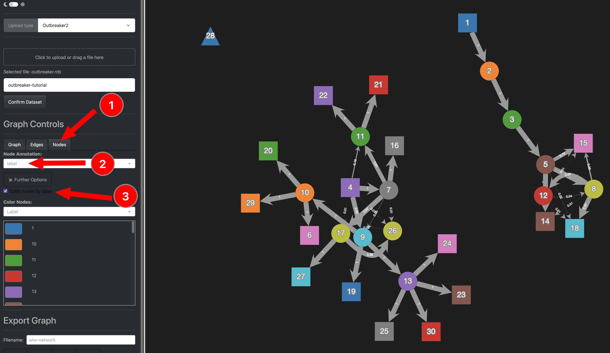
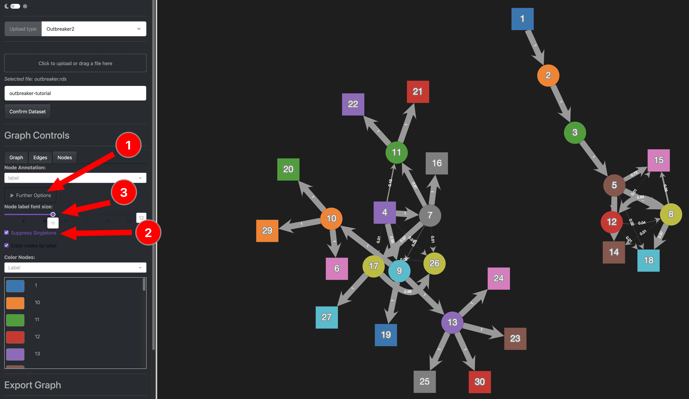
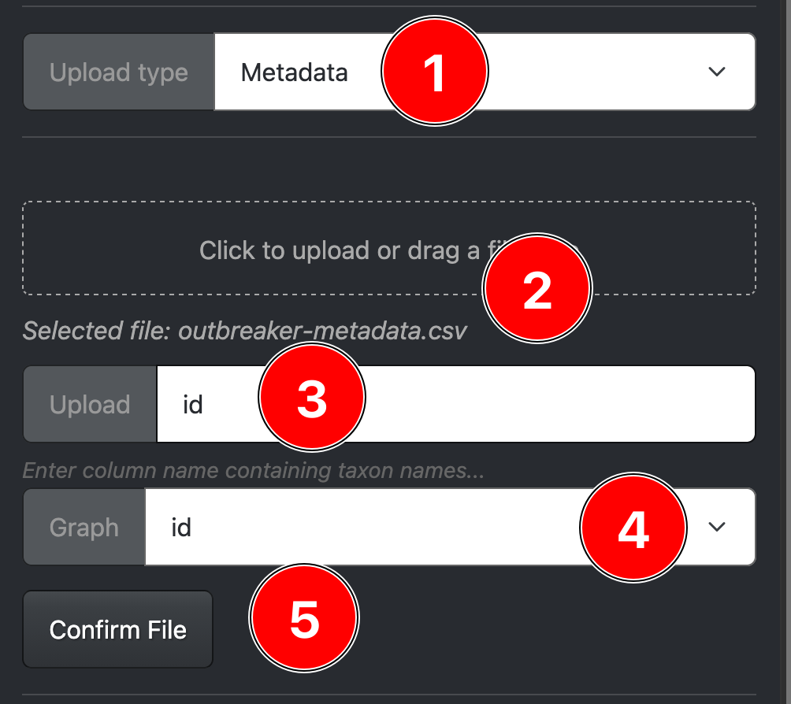
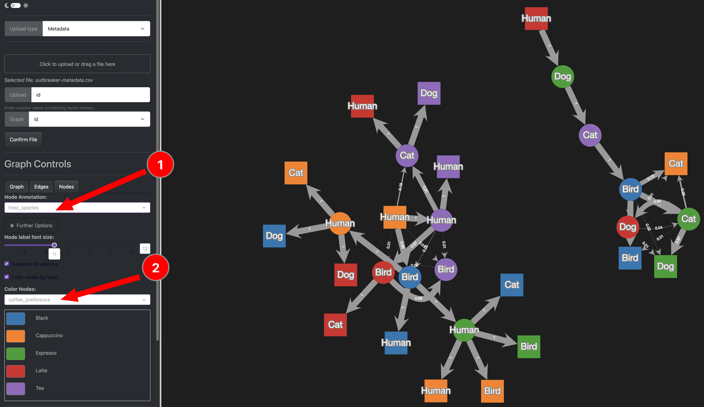
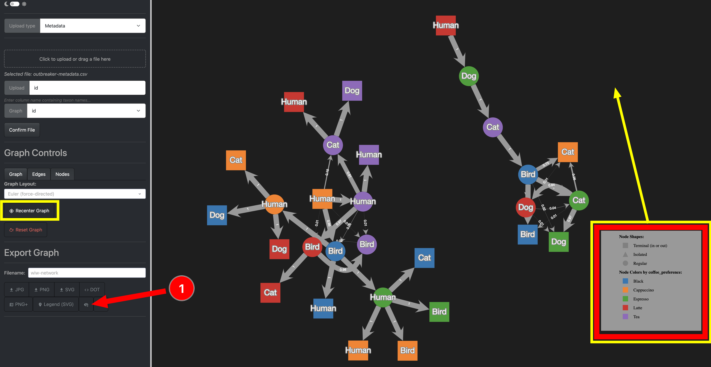
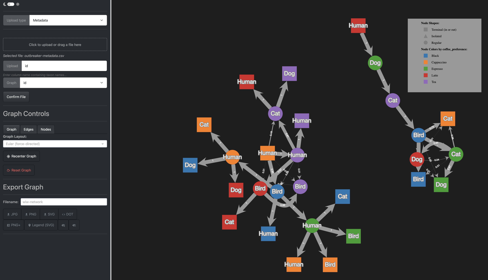

# Outbreaker 2

## Overview

Here we use the output of the **outbreaker2** package for R to visualize a WIW network.

You can find the full tutorial of the pacakge [here](https://www.repidemicsconsortium.org/outbreaker2/articles/introduction.html).

---

## Input Data

The supported uplaod format is a `.rds` file which can easily be produced from R by using the `saveRDS()` function.

See below for how the example data was created from the fake outbreak that comes alongside the outbreaker package:

```R
library(outbreaker2)

dna <- fake_outbreak$dna
dates <- fake_outbreak$sample
ctd <- fake_outbreak$ctd
w <- fake_outbreak$w
data <- outbreaker_data(dna = dna, dates = dates, ctd = ctd, w_dens = w)

## we set the seed to ensure results won't change
set.seed(1)

res <- outbreaker(data = data)

saveRDS(res, file="fake_outbreaker.rds")
```

### Download Example Data

If you want to follow along the data can be downloaded here:

- [The input rds file]()
- [The additional metadata]()

---
## Step 1: Upload the rds file


{: style="width:300px;"}


{: style="width:300px;"}


{: style="width:300px;"}


{: style="width:300px;"}


{: style="width:300px;"}


{: style="width:300px;"}


{: style="width:300px;"}


{: style="width:300px;"}


{: style="width:300px;"}


{: style="width:300px;"}

