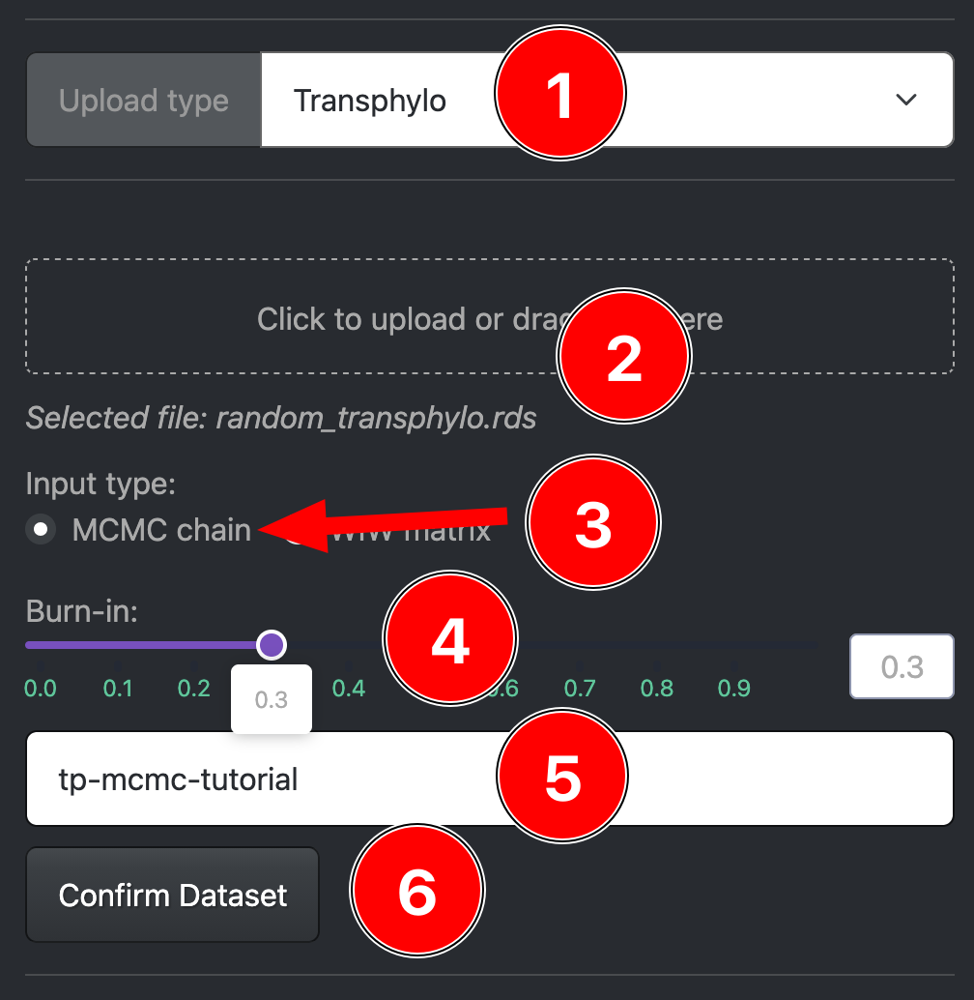
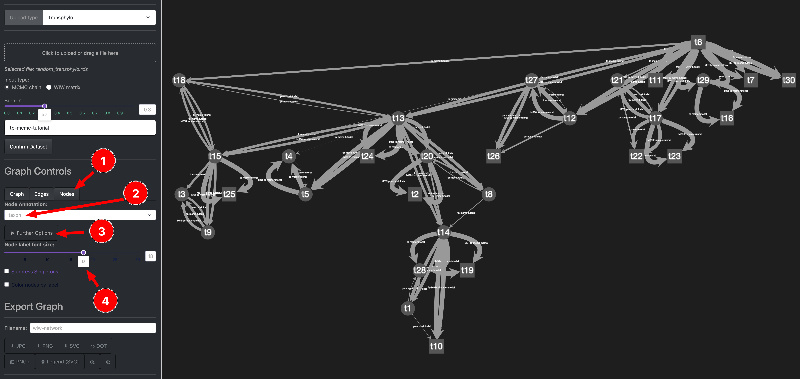
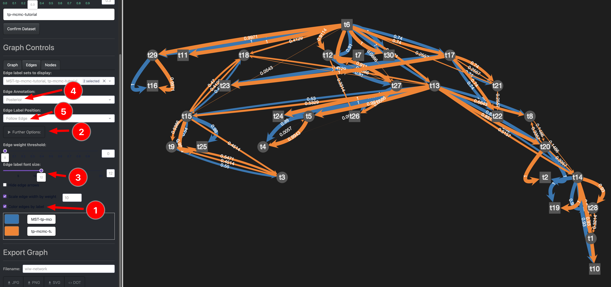
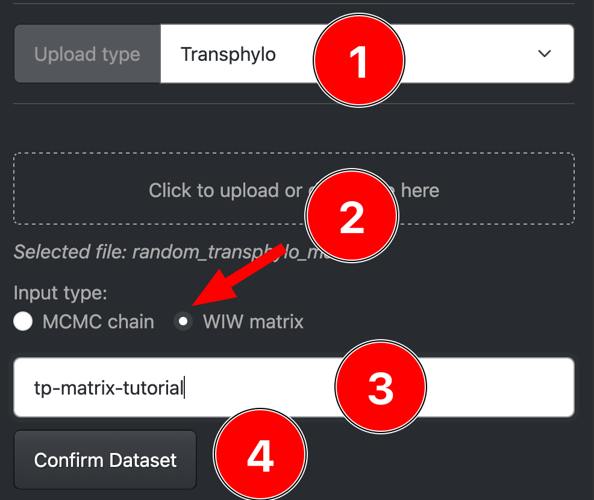
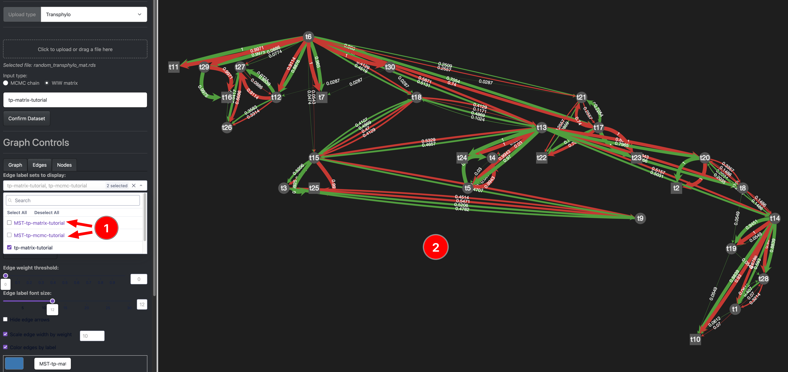
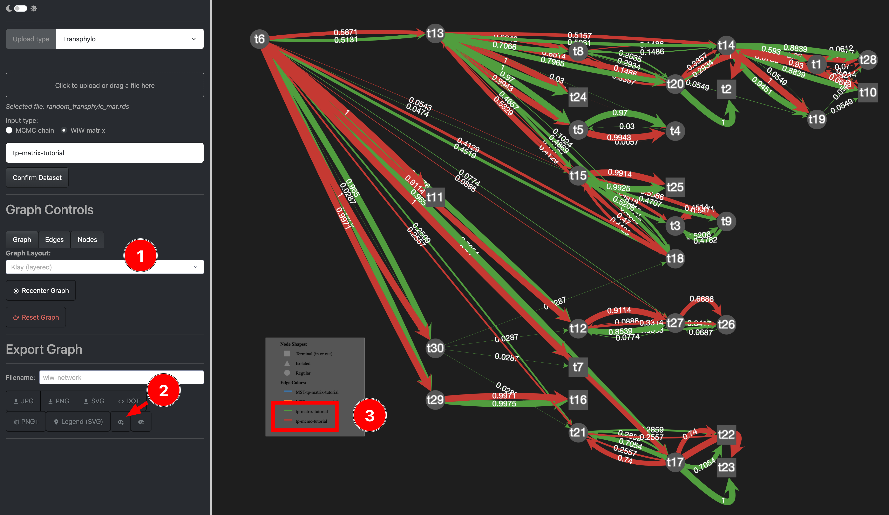
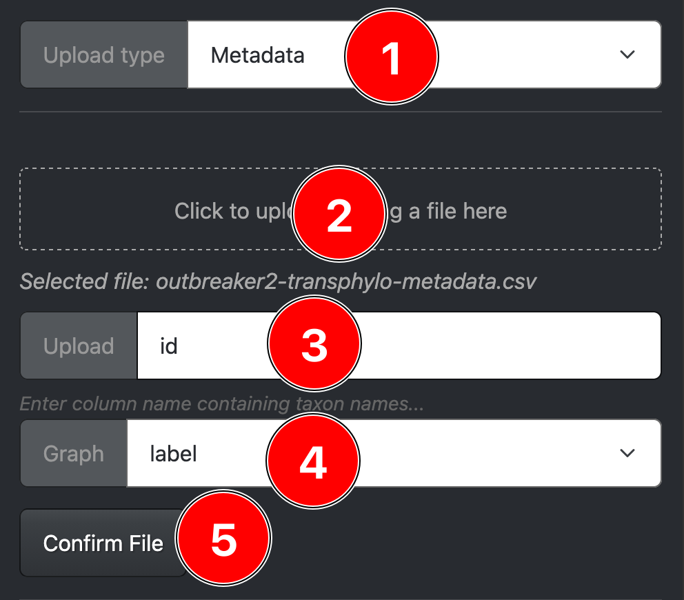
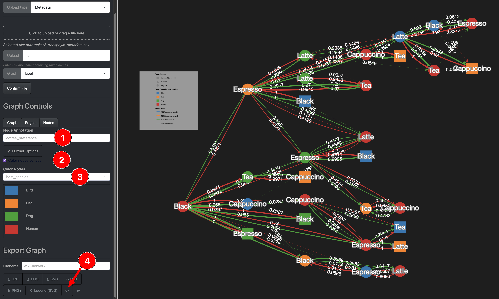

# Transphylo

## Overview

Here we use the output of the **TransPhylo** package for R to visualize a WIW network.

You can find the full tutorial of the pacakge [here](https://xavierdidelot.github.io/TransPhylo/index.html).

---

## Input Data

The supported upload format is a `.rds` file which can easily be produced from R by using the `saveRDS()` function.

See below for how the example data was created from a random tree using the `ape` package `rtree` function:

```R
library(ape)
library(TransPhylo)

set.seed(42)
phy <- rtree(n=30, rooted=T)
ptree <- ptreeFromPhylo(phy, dateLastSample=1916.42)
w.shape <- 10
w.scale <- 0.1
res <- inferTTree(ptree, mcmcIterations=1000,w.shape=w.shape,w.scale=w.scale)

saveRDS(res, file="random_transphylo.rds")

mat <- computeMatWIW(res, burnin=0.2)

saveRDS(mat, file="random_transphylo_mat.rds")
```

### Download Example Data

If you want to follow along the data can be downloaded here:

- [The MCMC input rds file](../assets/tutorial-data/random_transphylo.rds)
- [The Matrix input rds file](../assets/tutorial-data/random_transphylo_mat.rds)
- [The additional metadata](../assets/tutorial-data/outbreaker2-transphylo-metadata.csv)

---

## Upload rds files

### Upload the MCMC rds file

{: style="width:300px;"}

1. Select Transphylo as the upload type
2. Drag and drop the MCMC rds file into the selector
3. Select the MCMC chain as input type
4. Pick a burn-in, for the remainder of this tutorial we pick 0.3
5. Give the data an appropriate label
6. Confirm and upload the data

{: style="width:1300px;"}

After the upload you should see an empty graph, to add labels we do the following:
1. Select the Nodes graph controls tab
2. Pick your preferred Node annotation (Here we pick taxon)
3. Expand the further options tab
4. Increase the fontsize of the label at the nodes.

---

Now we switch to the edge settings:

{: style="width:1300px;"}

1. Select the edge tab under graph controls
2. Pick a different annotation label for the edges, here we pick posterior support
3. Change the edge label position, we pick follow the edge
4. Expand the further options tab
5. Increase the edge label font size
6. Toggle the option to color edges by label

### Upload the Matrix rds file

{: style="width:300px;"}

1. Select Transphylo as the upload type 
    - Drag and drop the matrix rds file into the selector
2. Pick the input type, in this case its WIW Matrix
3. Choose a label for this uploaded data
4. Confirm and extend the current network

---
### Compare the MCMC and Matrix upload

First we toggle off the constructed MST edges (1) leaving us with much less cluttered graph (2).

{: style="width:1300px;"}

For a different look we can change the graph layout, in this case we picked Klay (1).

We then add the legend node (2) and can use see which edge color corresponds to the MCMC 
and which to the precomputed WIW Matrix.
The observable differences mostly stem from a different choice of burn-in.
Note that there are also minor differences in the computation between the R package and this app.

{: style="width:1300px;"}

> **Optional:** 
> The above graph is still quite hard to interpret and labels are overlapping.
> Improve the comparison by either picking a different graph layout
> or by playing around with the settings and dragging the nodes into a different position

[//]: # (Todo this is currently buggy...)
[//]: # (**Optional:** Feel free to do a similar comparison for the MST trees. )

---

## Add metadata (optional)

To add more information to the nodes, we can upload a metadata `csv` file:

{: style="width:300px;"}

1. Select the Metadata upload type in the upload section
2. Drag and drop your metadata csv file into the selection
3. Select the name of the column in the csv file to associate with your nodes
4. Pick the (to step 3) corresponding node annotation
5. Confirm and add your metadata to your network

We can now use the network to display and color the nodes:

{: style="width:1300px;"}

1. Inside the Nodes graph options tab select one of the newly uploaded node annotation to display
2. Toggle on the color nodes by label option
3. Pick one of the annotation to use for the color of nodes
4. After uploading the metadata you might have to add the legend node again.

---
