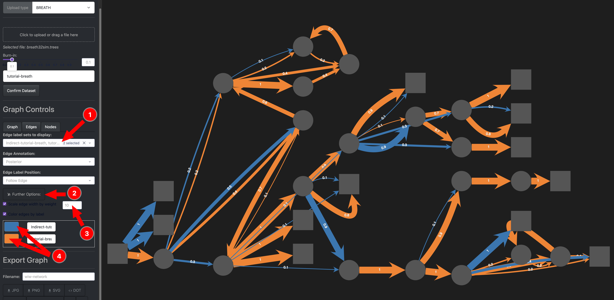

## Authors

Lars Berling

Jennifer McNichol

Jessica Stockdale

Caroline Colijn

## Affiliations

Simon Fraser University, Burnaby, BC, Canada

## Corresponding Author

Lars Berling, lars_berling@sfu.ca

# Introduction

There are lots of methods to reconstruct outbreaks and networks of person to person transmission:

- [@demaio2016scotti]
- [@demaio2018badtrip]
- [@skums2022sophie]
- [@waddel2025scitree]

Currently missing are breath, transphylo, outbreaker2, others?

# Methods

This is a test of a figure @fig-test and we see.

{#fig-test width=80%}

This is where we describe the methods for unknown infections and so on...

## Data

# Results

# Discussion

We do not support every software but our software makes it easy to add more options to upload different methods and their networks.
This allows a pracitioner to compare the output of different methods if they are interested in such a thing.

We also provide the first tool that allows to investigate indirect transmission, which are modelled in both breath and transphylo implicitly in the tranmission tree embedding.

# Acknowledgements

# References