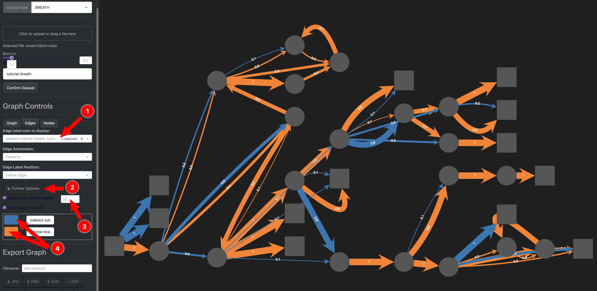

## Authors

Lars Berling

Jennifer McNichol

Jessica Stockdale

Caroline Colijn

## Affiliations

Simon Fraser University, Burnaby, BC, Canada

## Corresponding Author

Lars Berling, lars_berling@sfu.ca

# Abstract

In this paper we present an interactive framework for exploratory analyssi of inferred transmission networks.

The reconstruction of person to person transmission is a widely studied subject and there are
a plethora of methods that infer and reconstruct outbreaks from various kinds of different data.

Our program provides a locally running web based interface that is easy to use,
provides interactive visualizations which can easily be extended with metadata information
and supports a wide variety of input formats.
Our software is user friendly, easily extendible and freely available online.

# Impact Statement

When reconstructing the transmission history of an outbreak it is important to easily investigate the inferred transmission pathways.
Having an easy to use and interactive dashboard to investigate the results of an inference method
in combination with metadata about individuals can significantly improve the understanding of transmission pathways.
Our program, CONTAGION, is easy to use and run and makes the visualization of a who-infected-whom network
easy and available to a wide audience of users such as public health laboratories or medical researchers.

# Data Summary

The code for this software is freely available at https://github.com/Lars-B/.
The example datasets used within this publications are all available here...

# Introduction

background transmission tree reconstruction

overview of methods that have been developed over time
There are lots of methods to reconstruct outbreaks and networks of person to person transmission:

- [@demaio2016scotti]
- [@demaio2018badtrip]
- [@skums2022sophie]
- [@waddel2025scitree]

Currently missing are breath, transphylo, outbreaker2, others?

Point out that most methods infer a WIW network and that each program has its own way of visualizing it
Here we bring this together by providing a nicely packaged version that aims to support several methods at once
point out that we can interactively change different settings such as an edge threshold, colors of nodes/edges etc.
and we also provide an easy way to add metadata into the network that can help understand certain transmission pathways better

Understanding transmission dynamics during infectious disease outbreaks often requires analyzing complex contact structures.
Who-infected-whom (WIW) networks provide a representation of transmission histories in which nodes correspond to individuals and directed edges represent inferred transmission events.
These networks allow researchers to investigate properties of the outbreak such as super spreading, transmission or contact chains, outbreak structure, and temporal spread of disease.
However, exploring these WIW networks can be challenging when many individuals are present in the analysis or large amount of additional metadata is required.
Traditional static visualizations are often insufficient for investigating these structures and fixed to a specific application.
This motivates the development of tools that allow users to interactively explore and interrogate transmission networks from multiple inference software tools.

Beyond the visualizations we support the construction of MST, we have indirect transmission edges for several tools that allow this.
WE also have a statistic panel and download of it to get more information of the network with the metadata inside of it.

We could have a graphical abstract figure here:
some tool like TP/outbreaker2/breath --> wiw network file/ trees file --> upload to app --> all the app possibilities of color, thresholds, interactive stuff, metadata etc

# to be deleted

This is a test of a figure @fig-test and we see.

{#fig-test width=80%}

This is where we describe the methods for unknown infections and so on...

# Theory and Implementation

## Who infected whom networks

directed graphs
nodes are individuals
edges transmision events
edge weights often are posterior support (as most methods seem to be bayesian?)
metadata is more information about individuals such as age, sex, household, etc.

Example figure with illustration here?

## Why look at these networks

id transmission chains
detect spreading events/super spreader/ household infections etc
investigate clusters of self contained outbreaks, in particular if the tool allows for indirect/unsampled transmissions
inspect the support of inferred transmission histories, compare to known transmission events

## The power of interactive visualization?

static graph images are constraint, in particular mention the threshold of posteriro support on edges
difficult to add metadata or compare multiple different metadata categories
impossible to recolor or change the layout or just position of selected nodes
Todo if i implement a search function then we could point out that its hard to search these static images too
Layout changes and manual rearrangement is particularly useful for large networks (lots of edges)

At the time of writing our app supports the output of the followinag software tools:

- Scotti: a beast nexus tree file
- outbreaker2: rdata files with either a contact matrix or MCMC output
- transphylo: a rdata file with package specific format
- Breath: a beast nexus tree file
- custom csv graphs
- ...

## Implementation details

Our application is implemented in Python using the Dash framework [@parmer2025dash] for the web interface and
Cytoscape.js [@franz2016cytoscapejs], through the dash-cytoscape component, for interactive graph visualization.
The application runs locally or can be deployed as a web service, allowing users to explore the networks
directly within a browser.

Internally, the software has a modular architecture separating data handling, visualization, and user interface logic.
Each upload parser converts the inferred transmission data into a standard graph representation of nodes and edges.
Metadata is added to the node data and this representation is then shared between visualization and analytical components.
Interactive components such as filtering, coloring, metadata inspection, and network statistics
(e.g. node degree distributions or metadata-specific graph connectivity) are implemented through Dash callback functions that reactively update only the affected interface elements.

The application is open source (under a todo license) and easily extendable to new input types, since each upload format has its own parser but all parsers use the same graph representation format.
All code and a tutorial website with associated data is available on github [https://github.com/Lars-B/interactive-wiw].
The application is also packaged, via a GitHub Actions build pipeline, into a single executable for each major platform, available for download from the repository releases.

## The plain user interface

Should we have a panel describing the main interface of the app here? might be good, but as it could also change this might not be the best idea...

## Data application example 1

Use the TB outbreak and investigate some of the questions we asked for the sis-mid workshop

## Data application example 2

# Discussion

Strenghts of our app:
interactive
browser based easy and intuitive interface
single executable no package installation or running code necessary
extensible to many different tools
reproducible and consistent visualizations across different tools/input formats
configurable application

We do not support every software but our software makes it easy to add more options to upload different methods and their networks.
This allows a practitioner to compare the output of different methods if they are interested in such a thing.

We also provide the first tool that allows to investigate indirect transmission, which are modeled in both breath and transphylo implicitly in the transmission tree embedding.

Interactive visualization approaches provide an important complement to computational methods for analyzing infectious disease transmission reconstruction.
While statistical and phylogenetic approaches can infer the transmission relationships, visual exploration remains valuable for understanding the resulting structures and communicate findings.
Our application CONTAGION bridges this gap by providing an input agnostic interface to examine and explore inferred WIW networks interactively.

One problem is that we are limited by browser upload (its local but we need to load the file into it) speed and file size limits,
trees files are sometimes super large and it takes a while to parse them.

Only support a small fraction of available tools, but an external framework would be good to bring the field together maybe to support some standard output options?
also easily extendible so people could add support for their method instead of making their own figures.

Future work could focus on some more statistics that can be derived from these networks, metrics (such as the ones in juniper) to compare networks could be added.

# Author Statements

## Author contribution

## Conflicts of interest

## Funding information

## Acknowledgements

We would like to thank the participants of the 2026 SISMID workshop for providing valuable feedback on this application.

# References
